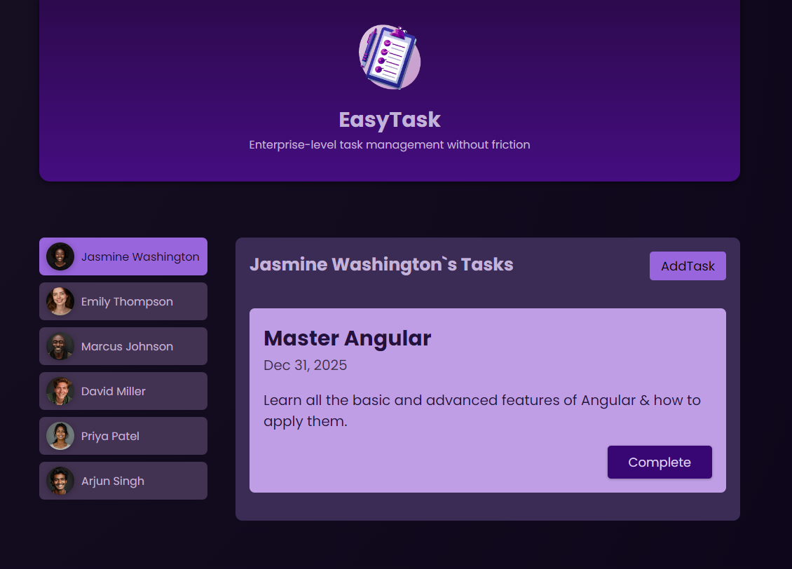

<h2 align="center">
  Welcome to Task Manager <br/>
  <a href="https://github.com/TihomirDenev/Task-Manager" target="_blank">Check it out on GitHub</a>
</h2>
<div align="center">

</div>

# 📝 Description

- Task Manager allows users to manage their tasks efficiently with a user-friendly interface. Users can view tasks assigned to them, add new tasks, and mark tasks as complete. The application is structured to support enterprise needs, providing seamless management of user tasks without any friction.

# 🗃️ Technologies Used

- **_Angular 18:_** For building a responsive and dynamic single-page application.
- **_TypeScript:_** To ensure type safety and scalable application development.
- **_CSS:_** For custom styling and responsive design.
  <br /><br />

# 💡 Features

- **_User Management:_** Handle multiple users and their associated tasks.
- **_Dynamic Task Creation:_** Add and manage tasks with due dates and summaries.
- **_Real-time Updates:_** Instantly see changes and updates to tasks without reloading the page.
- **_Responsive Design:_** Works seamlessly across various devices and screen sizes.
  <br /><br />

# ✅ Getting Started

1. Clone the Task-Manager [GitHub repository](https://github.com/TihomirDenev/Task-Manager) locally:

```bash
https://github.com/TihomirDenev/Task-Manager.git
```

2. Navigate to the project directory:

```bash
cd task-manager
```

3. Install Dependencies Before running the project, you need to install the necessary npm packages. Run the following command in the terminal:

```bash
npm install
```

4. To run the project, use the following command:

```bash
npm start
```

5. Open localhost link in browser to view web-platform.

# ⚙️ Usage

- Use this application to manage tasks efficiently within an enterprise environment. You can add, view, and complete tasks using the user-friendly interface provided.

# 📋 Code Structure

- **_app/:_** Contains all the components and services used in the application.
- **_header/:_** Displays the application header.
- **_tasks/:_** Manages all task-related components.
- **_user/:_** Handles user information and selection.

# ✨ Contributing

- Feel free to fork this repository and make a pull request if you have any improvements or bug fixes.

# 📇 License

- This project is licensed under the [MIT License](https://opensource.org/licenses/MIT).
