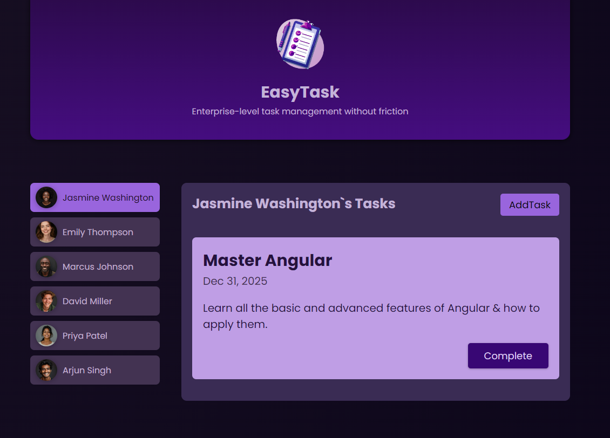

# 📋 Task Manager

A simple Angular-based task management application that allows users to create, view, and delete tasks. Built with Angular 18 and TypeScript.



## 🚀 Live Demo

[View the application](https://task-manager-five-kohl.vercel.app/)

## ✨ Features

- **User Selection**: Choose from 6 predefined users to manage their tasks
- **Task Management**: Create, view, and delete tasks for selected users
- **Task Details**: Each task includes title, summary, and due date
- **Local Storage**: Tasks are persisted in browser's localStorage
- **Responsive Design**: Works seamlessly across different screen sizes
- **Real-time Updates**: Changes are reflected immediately without page reload

## 🛠️ Technologies Used

- **Angular 18**: Modern Angular framework with latest features
- **TypeScript**: Type-safe JavaScript development
- **CSS**: Custom styling and responsive design
- **Local Storage**: Client-side data persistence

## 📦 Installation

1. **Clone the repository**

   ```bash
   git clone https://github.com/TihomirDenev/Task-Manager.git
   ```

2. **Navigate to the project directory**

   ```bash
   cd Task-Manager
   ```

3. **Install dependencies**

   ```bash
   npm install
   ```

4. **Start the development server**

   ```bash
   npm start
   ```

5. **Open your browser**
   Navigate to `http://localhost:4200` to view the application

## 🎯 How to Use

1. **Select a User**: Click on any user from the list to view their tasks
2. **View Tasks**: See all tasks assigned to the selected user
3. **Add New Task**: Use the "Add Task" button to create a new task with title, summary, and due date
4. **Delete Tasks**: Remove tasks by clicking the delete button on individual task cards

## 📁 Project Structure

```
src/app/
├── app.component.*         # Main application component
├── dummy-users.ts          # Predefined user data
├── header/                 # Application header component
├── shared/                 # Shared components (card)
├── tasks/                  # Task-related components
│   ├── new-task/           # Task creation component
│   ├── task/               # Individual task component
│   ├── tasks.component.*   # Task list component
│   └── tasks.service.ts    # Task management service
└── user/                   # User selection component
```

## 📝 Data Structure

### User Model

```typescript
interface User {
  id: string;
  name: string;
  avatar: string;
}
```

### Task Model

```typescript
interface Task {
  id: string;
  userId: string;
  title: string;
  summary: string;
  dueDate: string;
}
```

## 📄 License

This project is licensed under the MIT License - see the [LICENSE](LICENSE) file for details.

## 🙏 Acknowledgments

- Built with Angular 18
- Icons and styling created for this project
- User avatars are placeholder images
